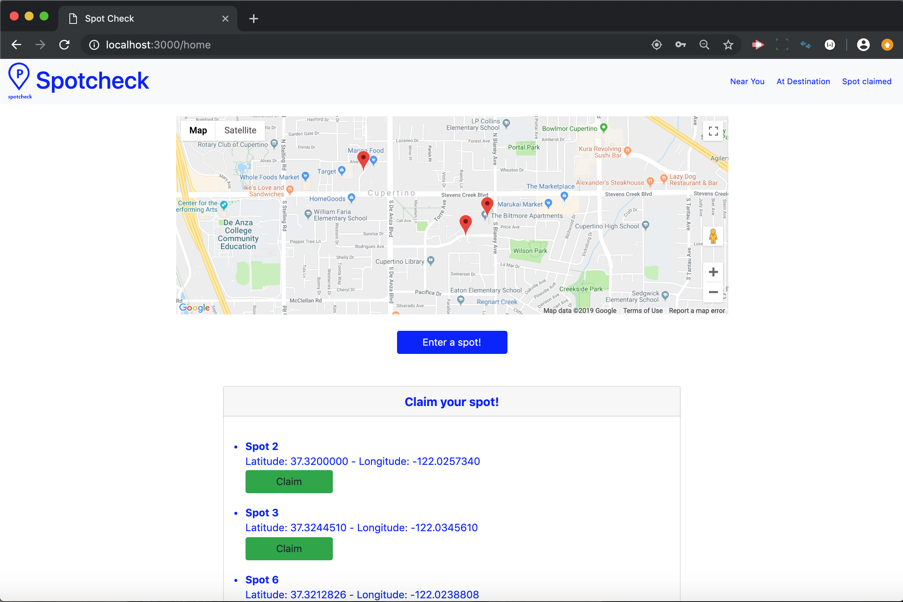

# Spot Check
An application to save you time and money while looking for parking.

## Motivation
Looking for parking spots is one of the few areas in life that we go into entirely blind; there usually isn't much rhyme or reason to how people circle some blocks in search of a spot to leave our car somewhere close to where we're going. Enter Spot Check, an app meant to crowdsource data on parking spots in order to make parking easier for everyone. It accomplishes this by returning all the parking data from within a set area around the user.

## How It Works
Spot Check sends out an Ajax call upon loading the home page, which requests a JSON document containing all parking spots in the database within half a degree of latitude and longitude from the user's current location in all four cardinal directions. The get request is then sent to the server which queries all the data within the database for all spots which match the parameters specified in the get request and it returns the data in the form of the aformentioned JSON document. The app also allows for a user to list their current location as a spot by using their current location in a post request sent to our database. Our database is also updated every time a user occupies a spot or tells the app that it wasn't available.

## Technology used
| Tool          | Application   | Result|
| ------------- |:-------------:| -----:|
| Handlebars | Basic Layout of document | The document has basic content |
| CSS | Styling the document | The webpage looks nice |
| Bootstrap | Ease of stying | The webpage looks nice and it is easier to make it look nice |
| Google Maps API | Basic Layout of document | The Webpage has basic mapping functionality |
| Node/Express | Server functionality | The Webpage can be deployed |
| Sequelize/SQL | Database Functionality | The Webpage can read, update, and store data|
| Passport | User Authentication | Users can create accounts and log in |

